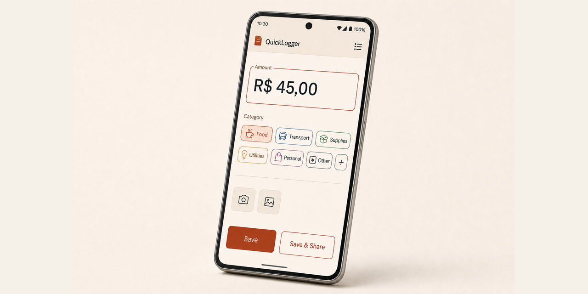

# QuickLogger



**Offline-first Android expense logger** — by Micha Schiess

Open the app, type an amount, tap a category, optionally snap a receipt, and save. That path stays under two seconds. Sharing is an extra step, not part of that budget.

QuickLogger is a pocket point-of-sale for cash and paper receipts, not another personal-finance suite. There is no account, no cloud, and no `INTERNET` permission. Data never leaves the device unless you send it through the system share sheet.

## Why it exists

Typical expense apps fail at the moment they are needed: a hardware-store counter, a fuel pump, a cash bakery.

- Logging a small purchase takes too many taps — accounts, dates, subcategories, “continue.”
- Cloud-backed apps stall without signal and collect telemetry the user did not ask for.
- Receipt photos land in the device gallery, then get lost in Camera.
- Sending a proof of purchase to a spouse or work group means screenshotting and pasting by hand.

QuickLogger treats that moment as a single action. History, period summaries, and CSV export exist, but they are not on the primary path.

## What you can do

| Action | How |
| --- | --- |
| Log an expense | Amount is focused on launch, with locale-aware currency formatting. Category is one tap. |
| Attach a receipt | System camera or photo picker. The file is copied into private app storage — never the gallery. |
| Categorize | Defaults: Food, Transport, Supplies, Utilities, Personal, Other. Custom categories can be added. |
| Share a log | After save, a WhatsApp-friendly caption (and the receipt, if any) goes out through the system share sheet. The app does not target the WhatsApp package. |
| Export a period | Daily, weekly, or monthly summary as share text, or a CSV via `FileProvider`. |

**Contractor:** log R$ 45.00 on parts, snap the paper receipt, send it to the work group.

**Household:** capture cash spends during the week; on Sunday export a summary or CSV.

## Architecture

Clean Architecture, MVVM, and unidirectional data flow. UI state is a `StateFlow`. The UI sends events up; it never writes state.

```
Presentation  —  Compose, Material 3, ViewModels, camera / picker / share sheet
      │
      ▼
Domain        —  Pure Kotlin models and use cases (no Android, Room, or Compose)
      ▲
      │
Data          —  Room (SQLite), private files, FileProvider paths
```

Dependency direction is one-way: **presentation → domain ← data**. The data layer implements domain interfaces.

Android’s official guide treats a domain layer as optional. This app keeps one: use cases *are* the product (`SaveExpense`, `BuildPeriodSummary`, `BuildExpensesCsv`), and they must be testable on the JVM without Robolectric.

| Layer | Owns |
| --- | --- |
| Presentation | Screens, navigation, ViewModels, Activity Result contracts, `ACTION_SEND` |
| Domain | Models, validation, repository interfaces, one-class-one-action use cases |
| Data | Room, `filesDir/receipts/`, SharedPreferences, CSV bytes in `cacheDir` |

Single Gradle module (`:app`), packages by layer. Feature modules would split a small offline app without earning the cost.

## Design decisions

| Decision | Reason |
| --- | --- |
| No `INTERNET` permission | Offline is enforced by the OS, not by convention. No HTTP client, no analytics, no crash telemetry. |
| Receipts under `context.filesDir` | Uninstalling the app removes every photo. Files leave only through `FileProvider`. |
| System share sheet, not `com.whatsapp` | Works if WhatsApp is missing; the OS chooses the destination. |
| Money as integer minor units, never `Double` | Totals stay exact. Currency code is stored per expense from the device locale at save time. |
| System camera + photo picker, not CameraX | Capture is a platform contract. An in-app preview would add taps to the two-second path. |
| `allowBackup` is false | Expense history and receipts are not copied to cloud backup. |
| `minSdk` 26 | Native `java.time`, Compose/Material 3 without extra compatibility work. Sideloaded APK, not a Play install-base bet. |

## Stack

| Area | Choice |
| --- | --- |
| Language | Kotlin, JDK 17 |
| UI | Jetpack Compose, Material 3 |
| Persistence | Room with KSP, SQLite |
| Async | Coroutines, Flow |
| DI / navigation | Hilt, Navigation Compose (single `Activity`) |
| Images | Coil (decode/display only) |
| Platform | `FileProvider`, `ActivityResultContracts.TakePicture()`, `PickVisualMedia`, `ACTION_SEND` |
| Distribution | Signed standalone APK via GitHub Actions on git tags — not a store app |
| Baseline | `minSdk` 26 (Android 8.0), `targetSdk` 36 (Android 16), `applicationId` `com.quicklogger.app` |

## Scope

**In this version**

- Local CRUD for expenses and categories
- Keyboard-first amount input with currency formatting
- Camera capture and gallery import into private storage
- Share text for one log and for day / week / month summaries
- CSV export through `FileProvider`
- Monthly spending targets (overall and per category)
- Automated signed APK on git tag

**Intentionally later**

Cloud sync, Google Sheets, biometric lock, receipt OCR, in-app CameraX, multi-currency wallets, budget periods other than the calendar month, recurring expenses.

## Development

Product, architecture, and visual language are specified before implementation. That is the source of truth for this repository:

1. [Product idea](docs/IDEA.md) — why, who, what
2. [Architecture](docs/ARCHITECTURE.md) — layers, data flow, platform rules
3. [Design](docs/DESIGN.md) — warm stationery, seed `#9A4A32`, art in [`assets/`](assets/)
4. [Sprints](docs/Sprint.md) — implementation sequence and exit criteria (no calendar)

```bash
git clone https://github.com/schiessti-afk/QuickLoggerBudget.git
```

Open the clone in Android Studio (latest stable) with JDK 17.

Local debug build:

```bash
./gradlew assembleDebug
```

Windows:

```powershell
.\gradlew.bat assembleDebug
```

Debug APK: `app/build/outputs/apk/debug/`.

Release APKs are produced by CI on a git tag (`v*`, for example `v1.0.0`). A local release build needs a keystore and `keystore.properties` at the repo root:

```
storeFile=upload-keystore.p12
storePassword=<store password>
keyAlias=<alias>
keyPassword=<key password>
```

Or the same four values as environment variables: `QUICKLOGGER_STORE_FILE`, `QUICKLOGGER_STORE_PASSWORD`, `QUICKLOGGER_KEY_ALIAS`, `QUICKLOGGER_KEY_PASSWORD`. `assembleRelease` fails if they are missing; it will not produce an unsigned APK.

GitHub Actions secrets (repository Settings → Secrets and variables → Actions):

| Secret | Gradle field |
| --- | --- |
| `RELEASE_KEYSTORE_BASE64` | `storeFile` (JKS/PKCS12, Base64-encoded) |
| `RELEASE_KEYSTORE_PASSWORD` | `storePassword` |
| `RELEASE_KEY_ALIAS` | `keyAlias` |
| `RELEASE_KEY_PASSWORD` | `keyPassword` |

Encode the keystore with `base64 -w 0 upload-keystore.p12` (Linux), `base64 -i upload-keystore.p12` (macOS), or `[Convert]::ToBase64String([IO.File]::ReadAllBytes("upload-keystore.p12"))` (Windows). **Never commit the keystore, `keystore.properties`, or passwords.**

## License

[MIT](LICENSE) © 2026 Micha Schiess
